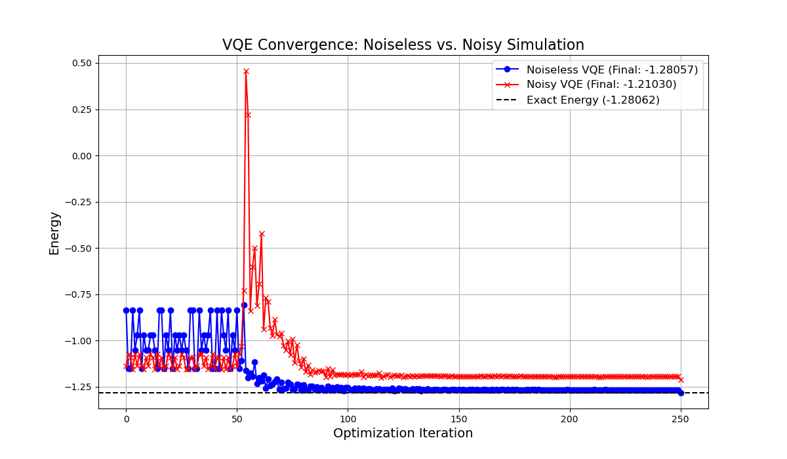

# Project 01: Noise-Aware VQE for a 2-Qubit Ising Model

---

## Overview

This project explores one of the key challenges of running quantum algorithms on **NISQ (Noisy Intermediate-Scale Quantum)** devices.  
Using the **Variational Quantum Eigensolver (VQE)** algorithm applied to a **2-qubit Ising Hamiltonian**, it visualizes how **quantum noise** distorts algorithmic performance and the optimization **energy landscape**.

To counteract these effects, the project implements **Zero-Noise Extrapolation (ZNE)** — a simple yet powerful **error-mitigation** method.

---

## Key Objectives

- **Implement VQE:** Compute the ground-state energy of a 2-qubit Ising model with Qiskit.  
- **Model realistic noise:** Build a `NoiseModel` in Qiskit Aer including `$T_1$`, `$T_2$`, and depolarizing errors.  
- **Analyze impact:** Compare convergence between **noiseless** and **noisy** VQE runs.  
- **Visualize landscapes:** Plot 3D energy-landscape surfaces to show how noise causes **distortion** and **flattening**.  
- **Apply error mitigation:** Use ZNE to **extrapolate** the zero-noise energy value (*s = 0*).  
- **Assess reliability:** Examine statistical limits of single-shot ZNE and demonstrate how **averaging multiple runs** yields more **robust** results.

---

## Tech Stack

| Category | Tools / Libraries |
|-----------|------------------|
| **Language** | Python 3.x |
| **Quantum SDK** | Qiskit (`qiskit_aer`, `qiskit_algorithms`, `qiskit.quantum_info`) |
| **Computation** | NumPy, SciPy (`curve_fit` for ZNE fits) |
| **Visualization** | Matplotlib (2D / 3D plots) |

---

## Key Results & Analysis

### A. Effect of Noise — Distorted Energy Landscape

Before analyzing the energy landscape or noise extrapolation, it is crucial to visualize how **noise directly affects the optimization process**.

| | |
|:--:|:--:|
|  |  
| *Noiseless VQE (blue) converges smoothly to the exact ground energy (−1.28057).  
Noisy VQE (red) oscillates heavily during early iterations and converges to a biased value (−1.21030), demonstrating the detrimental impact of decoherence and shot noise.* |

**Observation:**  
- The optimizer (SPSA) maintains stability under ideal simulation but struggles under realistic noise.  
- Despite reaching apparent convergence, the noisy run remains **~0.07 Ha above** the true ground state.  
- This quantitative gap is later mitigated using the ZNE method.

---

To understand how noise disrupts VQE optimization, a 2-parameter energy landscape was visualized:

| | | |
|:--:|:--:|:--:|
| **Noiseless** | **Noisy** | **Difference (Noisy − Ideal)** |
| *Clear global minimum valley.* | *Surface lifted up (energy bias), flattened landscape – optimizer struggles.* | *Heatmap shows distortion magnitude.* |

---

### B. Error Mitigation — Linear, Quadratic, and Statistical Analyses

This section demonstrates how **Zero-Noise Extrapolation (ZNE)** can mitigate quantum noise and how the choice of **fit model** and **sampling strategy** impacts the final result.  
VQE runs were performed at several noise-scaling factors *(s = 1, 3, 5)*, and their ground-state energies were extrapolated to the zero-noise limit *(s → 0)*.

---

#### **1️⃣ Linear Extrapolation**

A simple linear regression was applied to the noisy energy measurements:

| | |
|:--:|:--:|
||
| *Linear fit (E = 0.001·s − 1.211) predicts a mitigated energy of −1.21051, improving slightly over the unmitigated noisy value (−1.21030) but still far from the true energy (−1.28062).* |

---

#### **2️⃣ Quadratic Extrapolation**

Next, a second-order polynomial was fitted to capture nonlinear behavior:

| | |
|:--:|:--:|
||
| *Quadratic fit (E = −0.000·s² + 0.003·s − 1.212) gives a mitigated energy of −1.21248 — a marginal but more stable improvement over the linear fit.* |

**Observation:**  
Quadratic extrapolation smooths the statistical noise and better models the gradual distortion of the energy curve due to compound noise effects.

---

#### **3️⃣ Statistical Robustness: Single vs Averaged Runs**

To evaluate the stochastic limits of ZNE, each VQE measurement was repeated 10 times per noise scale and averaged:

| | |
|:--:|:--:|
||
| *Red: single-run measurements and fit (E₀ = −1.21248). Blue: averaged (10 runs) measurements and fit (E₀ = −1.23102). Exact energy = −1.28062.* |

**Key findings:**

1. **Single-run ZNE (red)** shows high variance and unreliable extrapolation due to stochastic optimizer and shot noise.  
2. **Averaged ZNE (blue)** significantly reduces variance and tracks the ideal energy more closely.  
3. The mitigated energy (−1.23102) from the averaged case approaches the exact value (−1.28062), demonstrating that **averaging is essential for trustworthy noise mitigation**.

---

**Summary:**  
| Method | Mitigated Energy | Error vs. Exact | Comment |
|:-------|:----------------:|:----------------:|:---------|
| Linear ZNE | −1.21051 | +0.070 | Minimal correction, underfitting |
| Quadratic ZNE | −1.21248 | +0.068 | Slightly improved, still noisy |
| Averaged ZNE (10 runs) | −1.23102 | +0.050 | Best stability, closest to true value |

> ✅ Averaging across multiple runs combined with higher-order extrapolation provides the most robust and physically consistent noise-mitigation outcome.

---

## 💡 Conclusions & Takeaways

- Quantum noise introduces **bias** and **landscape distortion** in VQE energy estimation.  
- **ZNE** effectively **mitigates** noise impact through simple extrapolation.  
- VQE + SPSA optimizers exhibit **high variance**; averaging is essential for stability.  
- Reliable error mitigation requires **multiple independent runs and statistical averaging**, as demonstrated here.

---

