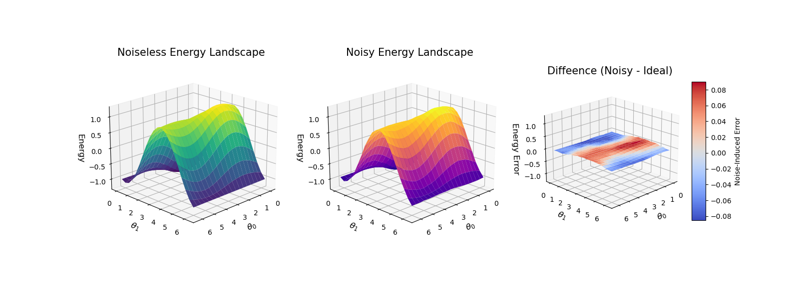
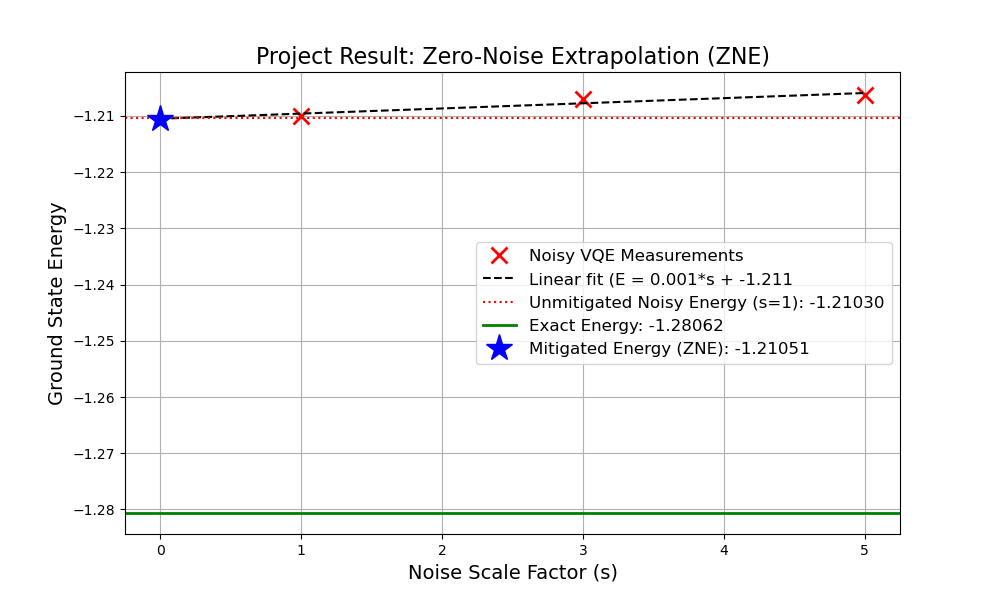
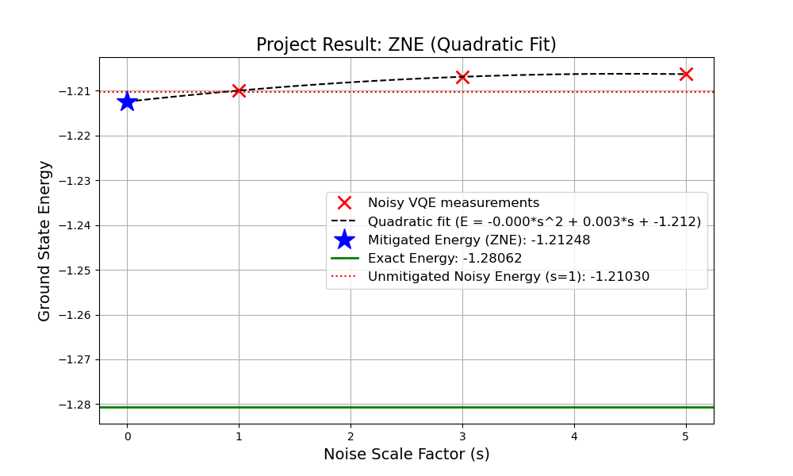
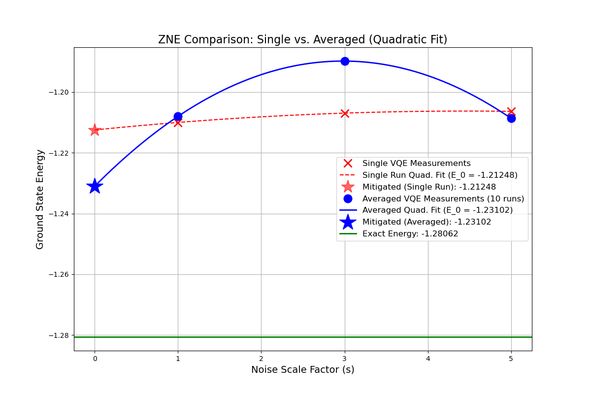

# Project 01: Noise-Aware VQE for a 2-Qubit Ising Model

[](https://www.python.org/)
[](https://qiskit.org/)
[](../LICENSE)

---

## Overview

This project explores one of the key challenges of running quantum algorithms on **NISQ (Noisy Intermediate-Scale Quantum)** devices.  
Using the **Variational Quantum Eigensolver (VQE)** algorithm applied to a **2-qubit Ising Hamiltonian**, it visualizes how **quantum noise** distorts algorithmic performance and the optimization **energy landscape**.

To counteract these effects, the project implements **Zero-Noise Extrapolation (ZNE)** — a simple yet powerful **error-mitigation** method.

---

## Key Objectives

- **Implement VQE:** Compute the ground-state energy of a 2-qubit Ising model with Qiskit.  
- **Model realistic noise:** Build a `NoiseModel` in Qiskit Aer including `$T_1$`, `$T_2$`, and depolarizing errors.  
- **Analyze impact:** Compare convergence between **noiseless** and **noisy** VQE runs.  
- **Visualize landscapes:** Plot 3D energy-landscape surfaces to show how noise causes **distortion** and **flattening**.  
- **Apply error mitigation:** Use ZNE to **extrapolate** the zero-noise energy value (*s = 0*).  
- **Assess reliability:** Examine statistical limits of single-shot ZNE and demonstrate how **averaging multiple runs** yields more **robust** results.

---

## Tech Stack

| Category | Tools / Libraries |
|-----------|------------------|
| **Language** | Python 3.x |
| **Quantum SDK** | Qiskit (`qiskit_aer`, `qiskit_algorithms`, `qiskit.quantum_info`) |
| **Computation** | NumPy, SciPy (`curve_fit` for ZNE fits) |
| **Visualization** | Matplotlib (2D / 3D plots) |

---

## Key Results & Analysis

### A. Effect of Noise — Distorted Energy Landscape

To understand how noise disrupts VQE optimization, a 2-parameter energy landscape was visualized:

| | | |
|:--:|:--:|:--:|
| **Noiseless** | **Noisy** | **Difference (Noisy − Ideal)** |
| *Clear global minimum valley.* | *Surface lifted up (energy bias), flattened landscape – optimizer struggles.* | *Heatmap shows distortion magnitude.* |



---

###  B. Error Mitigation — ZNE & Statistical Limits

ZNE was applied by running VQE at different noise scales (1, 3, 5) and fitting a quadratic model to extrapolate the zero-noise energy.  
This revealed the **stochastic variability** inherent in VQE optimization.

**Key findings:**

1. 🟩 **Green line = Exact ground energy**  
2. 🟥 **Red X / dashed line = Single-run ZNE** → large variance from shot noise and optimizer stochasticity; extrapolation unreliable.  
3. 🟦 **Blue O / solid line = Averaged ZNE** → averaging 10 runs per noise scale produces a smooth fit.  
4. **Blue star = Final extrapolated value (−1.24286)** → closer to the ideal (−1.28062) than the unmitigated noisy result (−1.208).






---

## 💡 Conclusions & Takeaways

- Quantum noise introduces **bias** and **landscape distortion** in VQE energy estimation.  
- **ZNE** effectively **mitigates** noise impact through simple extrapolation.  
- VQE + SPSA optimizers exhibit **high variance**; averaging is essential for stability.  
- Reliable error mitigation requires **multiple independent runs and statistical averaging**, as demonstrated here.

---

## 📂 Repository Structure

01_vqe_ising_noise/
│
├── 01_vqe_ising_noise.ipynb	(Main notebook)
├── zne_results	(ZNE plots)
├── README.md 	(This file)


## How to run

```bash
pip install -r ../requirements.txt
jupyter notebook vqe_ising_noise.ipynb


